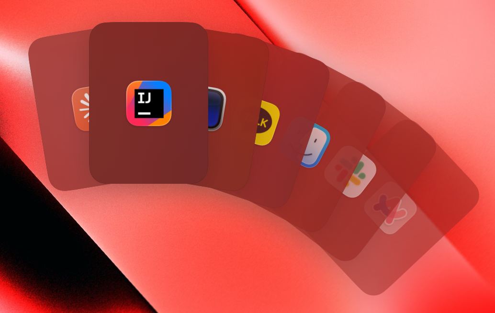
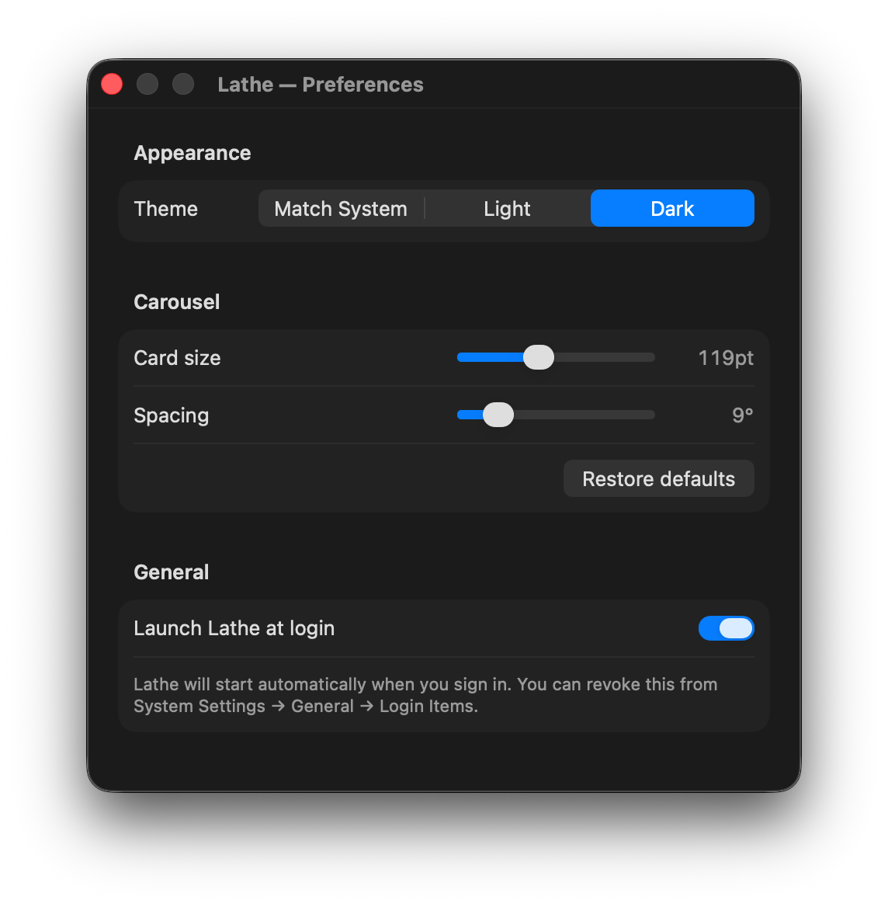

<h1 align="center">Lathe</h1>

<p align="center">
  <strong>직접 빌드하는 안전한 macOS ⌘+Tab 대체 앱입니다.</strong>
</p>

<p align="center">
  <a href="#왜">왜</a> •
  <a href="#설치">설치</a> •
  <a href="#소스에서-빌드">빌드</a> •
  <a href="#사용법">사용법</a> •
  <a href="#환경설정">환경설정</a> •
  <a href="#권한">권한</a> •
  <a href="#기술-스택">기술</a> •
  <a href="#라이선스">라이선스</a>
</p>

<p align="right">
  <a href="README.md">English</a> · 한국어
</p>

---

Lathe는 시스템 ⌘+Tab을 가로채 실행 중인 앱들을 부채꼴 캐러셀로 보여줍니다.
가운데 카드가 항상 포커스입니다 — ⌘ 누른 채로 Tab을 누르면 카드들이 회전하고,
⌘ 떼면 가운데 카드의 앱이 활성화됩니다.

<p align="center">
  
</p>

## 왜

⌘+Tab을 아이콘 한 줄짜리보다 더 보기 좋게 만들고 싶었고, 키 입력을 가로채는
앱의 소스 코드를 직접 읽을 수 있어야 한다고 생각했습니다. Lathe는 그 결과물입니다 —
오후 한나절이면 다 읽을 수 있을 만큼 작고, 본인 인증서로 직접 서명하며,
Accessibility 외에는 어떤 권한도 요구하지 않습니다.

## 설치

미리 빌드된 바이너리는 제공하지 않습니다 — 의도적입니다. 직접 컴파일하고
서명하는 것이 이 프로젝트의 핵심입니다.

1. 빌드 의존성을 설치합니다:

   ```bash
   brew install xcodegen
   ```

2. 클론 후 Xcode 프로젝트를 생성하고 엽니다:

   ```bash
   git clone https://github.com/hongmono/Lathe.git
   cd Lathe
   xcodegen generate
   open Lathe.xcodeproj
   ```

3. Xcode에서 `Lathe` target → Signing & Capabilities → Team에 본인의
   서명 인증서를 지정합니다 (아래 [코드 서명](#코드-서명) 참고). ⌘R 로 실행합니다.

4. 첫 실행 시 권한 안내 윈도우가 뜹니다. 시스템 설정에서 Accessibility
   권한을 부여한 뒤 다시 실행하세요 — event tap은 권한 부여 후 새 프로세스에서만
   동작합니다.

DMG도, 공증(notarization)도, `xattr` 우회도 없습니다. 빌드 산출물은
DerivedData 안에 있고 본인 로컬 인증서로 서명됩니다.

## 소스에서 빌드

### 툴체인

| 도구       | 버전                                    |
|------------|-----------------------------------------|
| macOS      | 14.6 (Sonoma) 이상                      |
| Xcode      | 15+ (Xcode 26에서 검증)                 |
| Swift      | 6.0                                     |
| `xcodegen` | latest (`brew install xcodegen`)        |

### 코드 서명

Lathe는 login keychain에 저장된 **자체 서명(self-signed) Code Signing 인증서**
`Lathe Local Dev` 로 서명됩니다. 중요한 이유 — macOS의 TCC(Accessibility 권한을
관장하는 시스템)는 앱을 **서명 인증서 ID 기준**으로 추적합니다. 안정적인 인증서를
쓰면 코드가 바뀌어도 cdhash 변경에 영향받지 않고 **부여된 권한이 매번 재빌드해도
유지됩니다**.

인증서 만들기:

1. **Keychain Access**를 엽니다 → 메뉴 **Certificate Assistant → Create a
   Certificate…**
2. 다음 항목을 입력합니다:
   - Name: `Lathe Local Dev`
   - Identity Type: `Self Signed Root`
   - Certificate Type: `Code Signing`
3. **"Let me override defaults"**를 체크 후 wizard를 진행하고, **Validity Period**
   를 `3650` (10년)으로 지정해 만료를 신경 쓰지 않게 합니다.
4. 마칩니다.
5. codesigning 용도로 키 권한을 부여합니다:

   ```bash
   security set-key-partition-list \
     -S apple-tool:,apple:,codesign: -s \
     -D "Lathe Local Dev" -t private \
     ~/Library/Keychains/login.keychain-db
   ```

   프롬프트에 macOS 로그인 비밀번호를 입력합니다.

다른 인증서(본인 Developer ID, 팀 인증서 등)를 쓰고 싶다면 `Project.yml`을
수정하면 됩니다:

```yaml
# Project.yml
settings:
  base:
    CODE_SIGN_IDENTITY: "Your Identity Name"
    DEVELOPMENT_TEAM: "YOUR_TEAM_ID"   # self-signed면 ""
```

### 일상 작업

`Project.yml` 또는 Swift 소스가 변경되면 Xcode 프로젝트를 다시 생성합니다:

```bash
xcodegen generate
```

Xcode에서 ⌘R로 빌드·실행하거나, 커맨드라인에서 실행합니다:

```bash
xcodebuild -project Lathe.xcodeproj -scheme Lathe -configuration Debug build
xcodebuild -project Lathe.xcodeproj -scheme Lathe test
```

## 사용법

| 입력                  | 동작                                            |
|-----------------------|-------------------------------------------------|
| ⌘+Tab                 | 캐러셀 표시, 직전 앱이 가운데로                  |
| ⌘ 유지 + Tab          | 다음 앱으로 회전                                 |
| ⌘ 유지 + ⇧Tab         | 이전 앱으로 회전                                 |
| ⌘ 떼기                | 가운데(포커스) 앱 활성화                          |
| ⌘ 유지 + Esc          | 활성화 없이 닫기                                  |

시스템 ⌘+Tab과 동작 모델이 같아 머슬 메모리를 그대로 쓸 수 있습니다. 차이점은
포커스가 캐러셀 가운데에 고정되고 카드들이 그 주위로 회전한다는 것뿐입니다.

## 환경설정

메뉴바 점선 원 아이콘 → **Preferences…** (또는 메뉴가 열려 있을 때 ⌘,)

<p align="center">
  
</p>

| 섹션       | 항목                  | 동작                                          |
|------------|-----------------------|-----------------------------------------------|
| Appearance | Theme                 | 시스템 매칭 / Light / Dark                    |
| Carousel   | Card size             | 카드 너비. 높이·pivot은 비율에 따라 자동 적용 |
| Carousel   | Spacing               | 카드 사이 펼침 각도(도)                       |
| General    | Launch Lathe at login | `SMAppService` 로 Login Item 등록             |

캐러셀 슬라이더는 **실시간으로 반영**됩니다 — 환경설정 윈도우를 켜둔 채
⌘+Tab으로 즉시 확인할 수 있습니다.

## 권한

Lathe는 ⌘+Tab을 글로벌하게 가로채는 `CGEventTap` 설치를 위해 **Accessibility**
권한이 필요합니다. 그 외에는 어떤 권한도 요청하지 않습니다 — Input Monitoring 없음,
Full Disk Access 없음, Screen Recording 없음. event tap은 ⌘ + Tab/⇧Tab/Esc
의 keyDown 이벤트로만 한정되며 그 외 모든 입력은 변형 없이 통과합니다.

권한 회수: 시스템 설정 → 개인 정보 보호 및 보안 → 손쉬운 사용 → Lathe 토글을 끕니다
(또는 항목을 삭제합니다).

서명 인증서가 안정적이라 재빌드해도 TCC 등록은 유지됩니다. 인증서를 바꾸거나
순환시키면 한 번 더 권한 다이얼로그가 뜨며, 옛 기록은 다음 명령으로 정리할 수
있습니다:

```bash
tccutil reset Accessibility com.hongmono.Lathe
```

## 기술 스택

- **SwiftUI + AppKit 하이브리드.** 캐러셀은 SwiftUI 뷰를 `NSPanel` 오버레이에
  호스팅합니다. 메뉴바 항목, hot key tap, workspace 옵저버는 AppKit입니다.
- **부채꼴 레이아웃.** 각 카드를 frame 밖에 놓인 pivot 기준으로
  `rotationEffect(_:anchor:)`로 회전시킵니다. 가운데 카드는 angle 0,
  양옆은 `±n × angularStep` 으로 펼쳐집니다. 수동 삼각함수 계산 없음,
  `GeometryReader` 복잡도 없음.
- **Event tap.** `CGEventTap` 두 개를 `cgSessionEventTap` /
  `headInsertEventTap` 위에 설치합니다 — 하나는 `flagsChanged` (⌘
  press/release 추적), 다른 하나는 `keyDown` (Tab / ⇧Tab / Esc를 가로채고
  소비).
- **앱 목록.** `NSWorkspace.runningApplications`를 `.regular` activation
  policy로 필터링하고, `didActivateApplication` 알림으로 갱신되는 인-프로세스
  MRU 큐로 정렬합니다.
- **설정 store.** `UserDefaults` 기반 `ObservableObject`. `CarouselView` 가
  observe 하고 있어 geometry 변경이 즉시 반영됩니다.
- **비공개 API를 사용하지 않습니다.** 사용된 API는 모두 macOS 14 시점에서
  공개 문서화된 것입니다.

### 프로젝트 구조

```
Lathe/
├── App/            LatheApp.swift, AppDelegate.swift
├── HotKey/         HotKeyMonitor.swift          (CGEventTap)
├── AppList/        AppEntry.swift, AppListProvider.swift
├── Overlay/        OverlayPanel + Controller, CarouselView/Model, CardView
├── Activation/     AppActivator.swift           (pid → activate)
├── Permissions/    AccessibilityChecker, PermissionPromptWindow
├── MenuBar/        MenuBarController.swift
├── Settings/       SettingsStore, SettingsView, SettingsWindowController,
│                   Appearance, LoginItem
└── Resources/      Info.plist, Assets.xcassets
LatheTests/         CarouselViewModelTests.swift
docs/
├── superpowers/    specs/  plans/                (디자인 history)
└── images/         README 스크린샷
```

### Spec & plan

원본 디자인 spec과 구현 plan도 같이 커밋되어 있습니다:

- [디자인 spec](docs/superpowers/specs/2026-04-28-lathe-design.md)
- [구현 plan](docs/superpowers/plans/2026-04-28-lathe-v1.md)

## 의도적 제외 (현재 v1)

- 파일 드래그 → AirDrop / 휴지통
- 같은 앱 윈도우 사이클 (⌘+\`)
- 숫자 키 / 첫글자 점프
- 트랙패드 스와이프 회전
- 마우스 hover / 클릭 선택
- 자동 업데이트

v1에서는 의도적으로 뺀 항목들입니다 — 필요하다면 코드 베이스가 작아서 한나절이면
추가할 수 있습니다.

## 릴리스

[`.github/workflows/release.yml`](.github/workflows/release.yml) 의
GitHub Actions 워크플로가 `v*` 태그 push (또는 수동 `workflow_dispatch`)
시 서명된 Release 아카이브를 빌드하고, 압축한 `.app` 을 GitHub Release에
첨부합니다.

### 1회성 secret 설정

워크플로는 로컬의 self-signed `Lathe Local Dev` 인증서를 사용하므로
runner 가 이 인증서를 import 할 수 있어야 합니다.

1. login keychain 에서 인증서 + private key 를 `.p12` 로 export 합니다:

   ```bash
   security export -k login.keychain -t identities -f pkcs12 \
     -P "<export-용-비밀번호>" -o /tmp/lathe-cert.p12
   # 이어 뜨는 다이얼로그에서 "Lathe Local Dev" 항목을 선택합니다.
   ```

2. base64 로 인코딩합니다 (GitHub secret 용):

   ```bash
   base64 -i /tmp/lathe-cert.p12 | pbcopy
   ```

3. GitHub 에서 **Settings → Secrets and variables → Actions → New
   repository secret** 으로 다음 세 개를 등록합니다:

   | 이름                    | 값                                                  |
   |-------------------------|-----------------------------------------------------|
   | `SIGNING_CERT_P12`      | 2단계에서 복사한 base64 문자열                      |
   | `SIGNING_CERT_PASSWORD` | 1단계에서 정한 export 비밀번호                      |
   | `KEYCHAIN_PASSWORD`     | 임의 문자열 — runner 쪽 임시 keychain 용 비밀번호    |

4. 로컬 복사본은 지웁니다: `rm /tmp/lathe-cert.p12`

### 릴리스 만들기

```bash
git tag v0.1.0
git push origin v0.1.0
```

워크플로가 빌드·서명·압축·발행을 자동으로 처리하고, 자동 생성된 릴리스
노트와 함께 release 가 만들어집니다. **Actions** 탭 → **Release**
워크플로 → **Run workflow** 로 수동 트리거도 가능합니다 (태그 지정).

### 한계

artifact 는 self-signed 인증서로 서명되기 때문에, 다른 사람이 다운받으면
Gatekeeper 의 "확인되지 않은 개발자" 차단에 걸려 한 번
`xattr -d com.apple.quarantine Lathe.app` 으로 우회해야 실행할 수
있습니다. 공개적으로 신뢰받는 배포가 필요하다면 유료 Apple Developer ID
인증서 + notarization 단계를 이 워크플로에 추가해야 합니다.

## 라이선스

[MIT](LICENSE) — fork·수정·재배포가 자유롭습니다. attribution만 유지해 주시면
됩니다.
